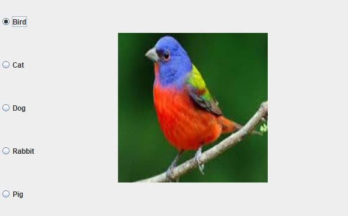
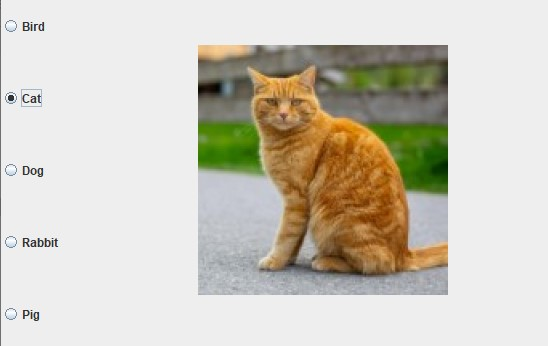
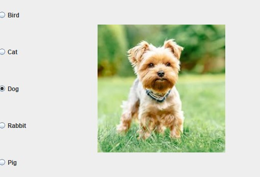
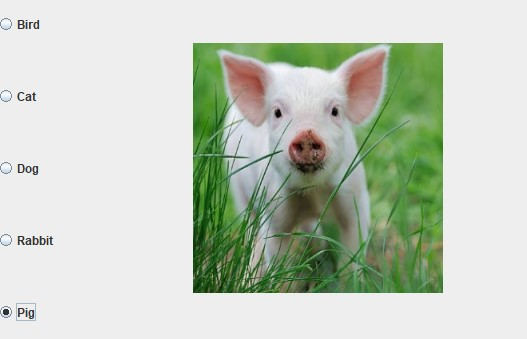

Java Swing Radio Button Pet Selector

This program demonstrates the use of five radio buttons:

Bird
Cat
Dog
Rabbit
Pig

When a radio button is selected, the corresponding pet image is displayed.

Screenshots of the program are shown below.

